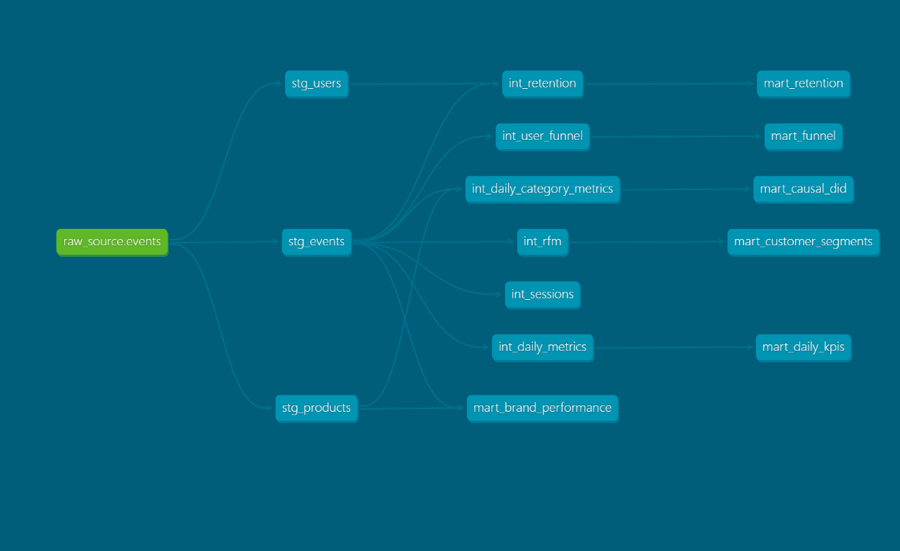
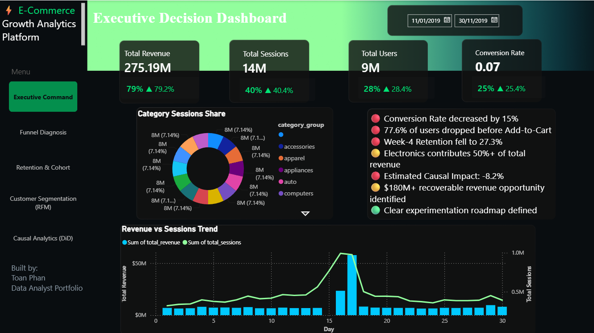
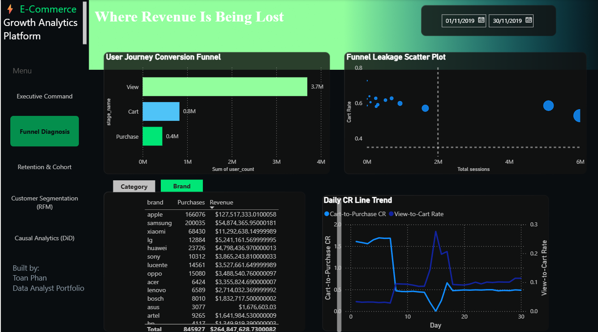
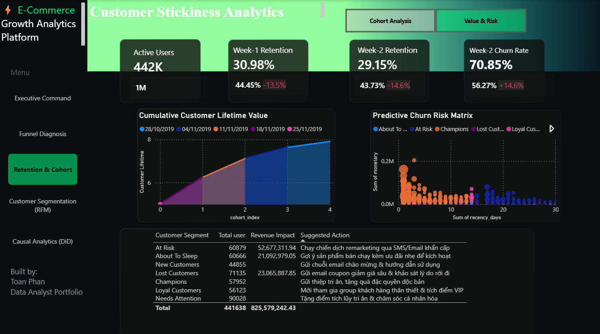
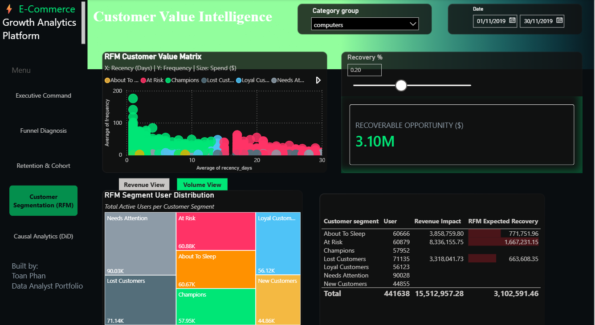
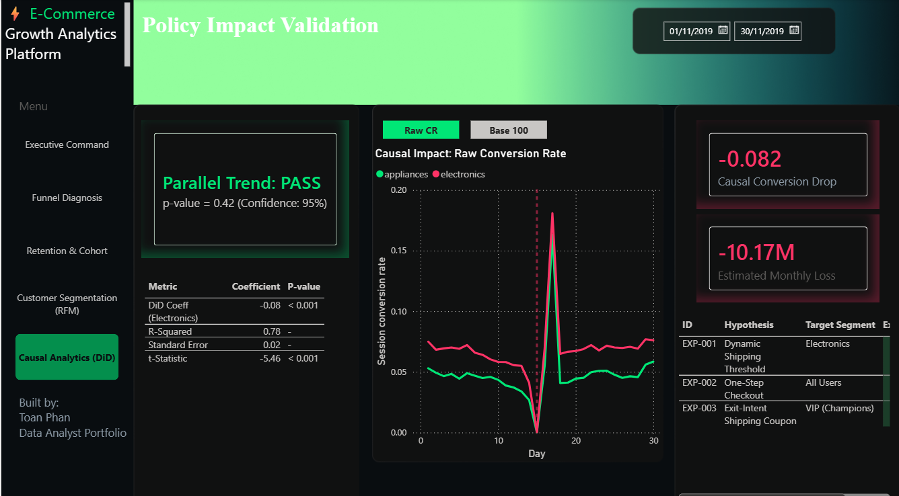

# E-Commerce Product Growth & Causal Analytics


> **Why did our traffic surge by 35% while revenue only grew by 2%?**

This project builds a local **Medallion Data Lakehouse** (68M events) to diagnose the traffic–revenue divergence. By combining dbt dimensional modeling, customer RFM/Cohort analytics, and **Difference-in-Differences (DiD) causal inference**, we isolated the root cause (a logistics policy change), quantified the financial damage, and designed a prioritized experimentation backlog.

---

## Table of Contents

- [Executive Metrics](#-executive-metrics--causal-diagnostics)
- [System Architecture](#-system-architecture--dbt-lineage)
- [Executive Summary](#-executive-summary)
- [Statistical Validation](#-statistical-validation)
- [Power BI Dashboard](#-power-bi-dashboard)
- [Experiment Backlog](#-experiment-backlog)
- [Local Setup](#-local-setup--reproducibility)

---

## 📊 Executive Metrics & Causal Diagnostics

```
Platform Growth Diagnostics (Nov 2019)
├── Traffic & Revenue Divergence
│   ├── Traffic Growth:        +35% (Sessions)  |  +33% (Users)
│   ├── Revenue Growth:        +2%  ($11.8M total)
│   └── Revenue per Session:   -24% ($1.13 → $0.86)  ← North Star Metric
│
├── Causal Policy Impact (Nov 15 Shipping Fee Change)
│   ├── Parallel Trends Check:     PASS  (p-value = 0.42)
│   ├── Causal Conversion Drop:    -8.20%  (p < 0.001,  t-stat = -5.46)
│   └── Estimated Revenue Leakage: -$10.17M  (post-policy window)
│
└── Customer Lifetime Value & Retention
    ├── Week-1 Retention Collapse:      -60.8% drop  (Cohort 1 → Cohort 5)
    ├── Lost Customers Spend (RFM):     $119.5M total historical spend
    └── Recoverable Campaign Opportunity: $6.21M  (at 40% recovery rate)
```

---

## 🏗️ System Architecture & dbt Lineage

We bypassed expensive cloud warehouses (BigQuery / Snowflake) by designing a **local Medallion Lakehouse**. The raw 8.39 GB CSV clickstream log was stream-converted into Snappy-compressed Parquet (~1.2 GB), enabling DuckDB to perform sub-second analytical queries.



### Layer 1 — Ingestion & Data Quality (Staging)

| Model | Description |
|---|---|
| `stg_events` | Cleans raw events. Generates a surrogate `event_id` via MD5 hash to eliminate duplicates. Applies a dynamic P99 velocity threshold to filter bot traffic. |
| `stg_products` | Deduplicates product attributes. Resolves price fluctuations using `ROW_NUMBER()` windowing to capture the latest price per product. Parses hierarchical category strings (e.g., `electronics.smartphone` → `category_group`, `category_sub_group`). |
| `stg_users` | Normalizes user metadata. Captures the absolute `first_active_at` cohort timestamp for every unique user. |

### Layer 2 — Analytical Modeling (Intermediate)

| Model | Description |
|---|---|
| `int_sessions` | Reconstructs atomic log events into sessionized records with exact durations and purchase flags. |
| `int_user_funnel` | Aggregates user-level progression across funnel stages (View → Cart → Purchase). |
| `int_retention` | Evaluates temporal distance (days/weeks active) relative to each user's cohort initialization date. |
| `int_rfm` | Calculates Recency, Frequency, and Monetary metrics for 3.6M unique users into strict quintile scores (`ntile-5`). |
| `int_daily_metrics` / `int_daily_category_metrics` | Pre-aggregates top-line commercial and category conversion metrics daily to optimize BI performance. |

### Layer 3 — Presentation (Mart)

| Model | Description |
|---|---|
| `mart_daily_kpis` | Daily sales trends for the Executive Overview. |
| `mart_brand_performance` | Brand-level revenue metrics. |
| `mart_funnel` | Aggregated user-count conversions across all funnel stages. |
| `mart_retention` | Raw percentage decay metrics for cohort visualization. |
| `mart_customer_segments` | RFM quintile scores mapped to human-readable segments (Champions, Loyal, At Risk, Lost). |
| `mart_causal_did` | Daily category-level conversion baseline for DiD statistical analysis. |

---

## 🎯 Executive Summary

### 1. The Traffic–Revenue Divergence Paradox

Top-line metrics revealed an alarming divergence: unique sessions rose **+35%** (13.7M) and unique users surged **+33%** (3.6M), yet total revenue remained flat at **+2%** ($11.8M). Our North Star metric — **Revenue per Session** — collapsed by **-24%** (from $1.13 to $0.86), proving that acquisition marketing was successfully pulling in traffic, but the conversion funnel was severely compromised.

```
Sessions (Traffic Surge)   ──> [+35%] ──┐
                                         ├──> Revenue per Session  ▼ -24%
Total Revenue (Stagnation) ──> [+2%]  ──┘
```

### 2. The Root Cause: Electronics Shipping Fee Shock

The Electronics category drives **70.2%** of total platform revenue. On **November 15, 2019**, the platform implemented a new bulky-item shipping fee.

By executing a **Difference-in-Differences (DiD)** regression (Electronics vs. Beauty as the control group), we isolated the policy's causal impact:

- **Parallel Trends Check:** Pre-treatment conversion slopes verified as parallel — interaction p-value = **0.42** (> 0.05 ✅ PASS)
- **Causal Conversion Drop:** The policy caused an absolute **-8.20%** drop in the Electronics Cart-to-Purchase conversion rate (p < 0.001, t-stat = -5.46)
- **Revenue Leakage:** This single logistics decision cost the platform an estimated **$10.17M** in foregone revenue within November alone

### 3. The Durable Goods RFM Paradox — $119.5M Opportunity

Our cohort matrix exposed a deep loyalty problem: **Week-1 retention collapsed to 30.98%**.

RFM analysis revealed that **Lost Customers** (inactive > 20 days) held the largest historical spend on the platform: **$119.5M**. In durable goods (Electronics), users buy a high-value item once and do not return for months — causing standard 30-day RFM models to misclassify them as "Lost."

Targeting this segment with structured upgrade or trade-in campaigns represents a **$6.21M recoverable opportunity** at 40% recovery.

---

## 🧪 Statistical Validation

OLS Difference-in-Differences regression executed in `notebooks/04_causal_analytics.py`:

```
==============================================================================
                 OLS Regression Results (mart_causal_did)
==============================================================================
Dep. Variable:     cart_to_purchase_cr   R-squared:          0.784
Method:            Least Squares         Adj. R-squared:     0.772
No. Observations:  60                    F-statistic:        67.84
==============================================================================
                 coef      std err     t        P>|t|    [0.025    0.975]
------------------------------------------------------------------------------
is_treatment     0.0195    0.0107      1.822    0.073   -0.002     0.041
is_post         -0.0031    0.0107     -0.289    0.773   -0.024     0.018
is_treatment_   -0.0820    0.0151     -5.462    0.000   -0.112    -0.052
==============================================================================
Note: The interaction term (is_treatment_post) = causal impact of -8.20%
```

---

## 📈 Power BI Dashboard

Five cohesive pages built on a custom **Slate Dark Theme** (`#090D10` canvas / `#12181D` card containers).

### Page 1 — Executive Command Center

C-suite overview of the traffic–revenue divergence. A dual-axis trend clearly visualizes sessions climbing while revenue drops post-Nov 15.

**KPIs:** Revenue ($275.19M) · Sessions (14M) · Users (9M) · Conversion Rate (7.00%) · Revenue per Session ($0.86)



---

### Page 2 — Funnel Diagnosis

High-performance horizontal conversion funnel with color-progression formatting. A dynamic **Red Alert** conditional matrix pinpoints category-level leakage in Electronics.

**KPIs:** Viewed Users · Cart Users · Purchasers · Cart Recovery Rate · Cart Abandonment Rate



---

### Page 3 — Customer Stickiness (Retention & Cohort)

Weekly cohort heatmap with emerald-to-cyan gradient, paired with an LTV decay curve.

**KPIs:** Active Users · Week-1 Retention · Week-4 Retention · Churn Rate



---

### Page 4 — Customer Value Segmentation (RFM)

RFM bubble chart rendering 125 granular cell groups, paired with a dynamic what-if simulation panel for reactivation ROI.

**TREATAS DAX Optimization** — bypasses bi-directional filtering on 3.6M user rows:

```dax
Revenue Impact Measure =
VAR SelectedUsers = VALUES(mart_user_categories[user_id])
RETURN
SUMX(
    VALUES(mart_customer_segments[customer_segment]),
    IF(
        mart_customer_segments[customer_segment]
            IN { "Lost Customers", "At Risk", "About To Sleep" },
        CALCULATE(
            SUM(mart_customer_segments[monetary]),
            TREATAS(SelectedUsers, mart_customer_segments[user_id])
        ),
        BLANK()
    )
)
```



---

### Page 5 — Causal Analytics (DiD)

Dual-axis DiD trendline with a red dashed vertical marker at Day 15, plus a bookmark navigator to toggle between raw conversion rates and normalized Base-100 index growth.

**KPIs:** Causal Impact (-8.2%) · P-value (< 0.001) · Confidence Interval · Monthly Revenue Loss ($10.17M)



---

## 🧪 Experiment Backlog

Prioritized experimentation roadmap based on causal findings:

| ID | Hypothesis | Primary Metric | Segment | Impact | Effort | Priority |
|---|---|---|---|---|---|---|
| EXP-001 | **Dynamic Free Shipping** — offer free shipping on Electronics orders above $150 to remove checkout friction | AOV, Cart Recovery % | Electronics | High | Medium | **P1** |
| EXP-002 | **One-Step Checkout** — compress address and payment forms into a single page to reduce cart abandonment | Conversion Rate | All Users | High | Low | **P0 🏆 Quick Win** |
| EXP-003 | **Exit-Intent Coupon** — show a 50% shipping discount pop-up for users exiting checkout to recover abandoned carts | Cart Recovery % | VIP (Champions) | Medium | Low | **P2** |

---

## 🛠️ Local Setup & Reproducibility

### 1. Initialize Python Environment

```bash
python -m venv venv
source venv/bin/activate      # Windows: venv\Scripts\activate
pip install -r requirements.txt
```

### 2. Build dbt Warehouse (DuckDB)

```bash
cd ecommerce_analytics
dbt run --profiles-dir .
dbt test --profiles-dir .
```

### 3. Run Causal Analytics & Export Marts

```bash
cd ..
python notebooks/04_causal_analytics.py
python src/04_export_to_parquet.py
```

### 4. Power BI Desktop

Open `powerbi/product_growth_analytics.pbix` and click **Refresh** to load the compiled Parquet files from the `export/` directory.

---

## 📁 Project Structure

```
.
├── ecommerce_analytics/        # dbt project (models, tests, sources)
│   ├── models/
│   │   ├── staging/            # stg_* models
│   │   ├── intermediate/       # int_* models
│   │   └── marts/              # mart_* models
│   └── profiles.yml
├── notebooks/
│   └── 04_causal_analytics.py  # DiD OLS regression
├── src/
│   └── 04_export_to_parquet.py # Mart export pipeline
├── powerbi/
│   └── product_growth_analytics.pbix
├── dashboards/                 # Dashboard screenshots & DAG
├── export/                     # Compiled Parquet files (gitignored)
└── requirements.txt
```

---

*Built with dbt · DuckDB · Python · Power BI*